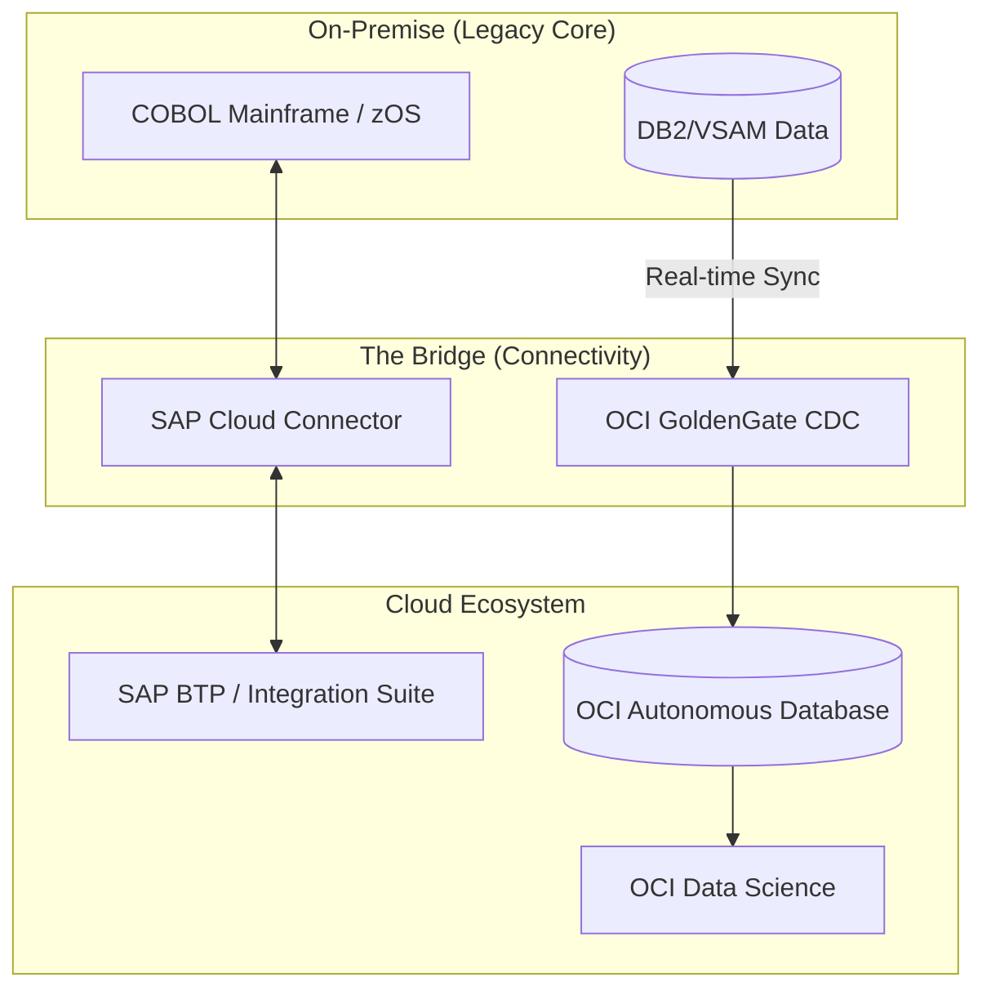

# Enterprise-Update
Modernization of a large-scale corporate infrastructure

---

## 1. Use a "Project Header"
Start with a clear title and a "Status" badge to make it look official.

```markdown
# 🚀 Project Connection 33.6: Modernization Strategy
> **Target Revenue:** R$ 33.6 Billion | **Status:** Implementation Phase
```

## 2. Use Markdown Tables for the Pillars
The pillars of value creation look best in a clean table. Markdown handles this easily:

| Pillar | Value Impact | Primary Driver |
| :--- | :--- | :--- |
| **OpEx Efficiency** | +R$ 640M | Latency recovery (900ms → 12ms) |
| **Downtime Reduction** | +R$ 160M | Multi-cloud Disaster Recovery |
| **Data Intelligence** | +R$ 800M | Real-time predictive analytics (SAP/OCI) |

## 3. Visualize the Architecture
Since this involves a "Hybrid Bridge," a diagram is much more effective than text alone. You can use **Mermaid.js**, which renders directly in GitHub READMEs.


Insert this code block into your README:



## 4. Use "Collapsible" Sections (Details)
Since the report is long (hardware specs, floor plans, etc.), use the `<details>` tag. This keeps your README clean while allowing users to click to see more.

```markdown
<details>
<summary><b>🛡️ Click to view Security & Post-Quantum Readiness</b></summary>

### Military-Grade Security
* **Encryption:** AES-256-GCM at rest; TLS 1.3 + MACsec in transit.
* **PQC (Post-Quantum):** ML-KEM (Kyber) and ML-DSA (Dilithium).
* **Key Management:** FIPS 140-2 Level 3 HSMs with self-destruct protocols.
</details>
```

## 5. Performance Benchmarks
Use a comparison table to highlight the "Before vs. After" impact.

| Metric | Legacy State | Modernized State (Target) |
| :--- | :--- | :--- |
| **Latency** | 900ms | **12ms** |
| **Throughput** | 400 TPS | **4800 TPS** |
| **Availability** | Variable | **99.99%** |

---
